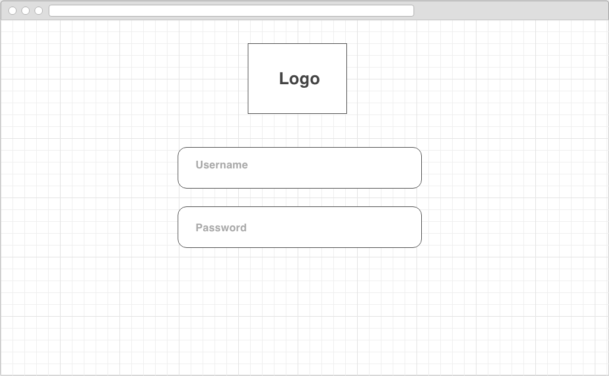
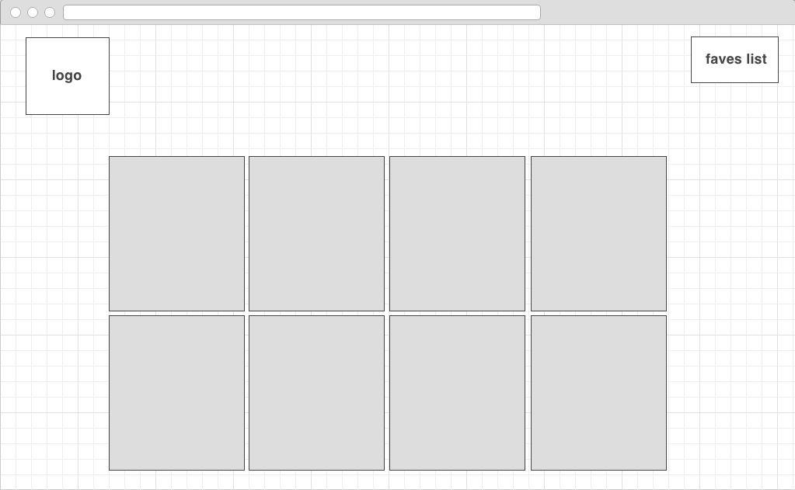
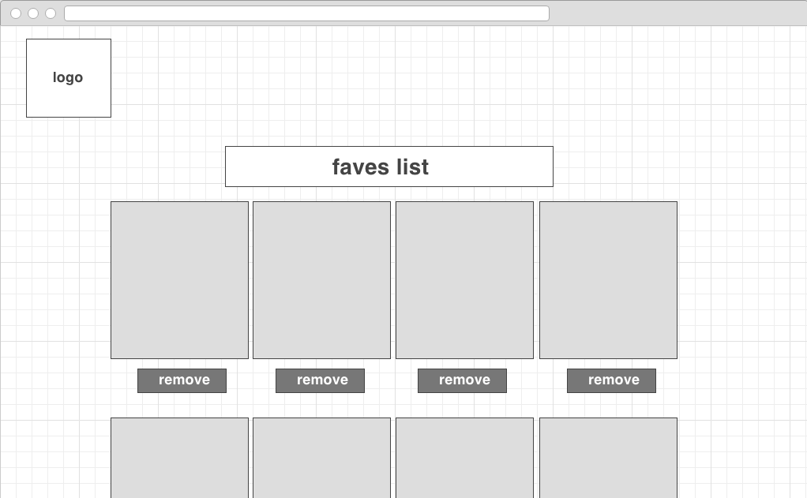

# project-two

API Used:
http://pokeapi.co/

Use:
User can search for and save their favorite Pokemon
No need to open up your NDS to check what Pokemon you have, user can just check their Faves :)

PokeFave
1. Sign up / Log in to account
2. Will be directed to search page - can search for any Pokemon
3. Have to option to 'Fave' the Pokemon
4. Faved Pokemon will be stored into Fave page
5. Can Delete Faved Pokemon in the Fave page

Above - wireframe for home page to sign in.

Above - original idea for search page where all designs will be loaded onto page and user can choose out of the collection what to fave. (Design page had Oauth)

Above - wireframe of Fave page that will list all favorited Pokemon. Can delete

Credits:

♡ Thanks for the help: ♡
Nicky / Alex / Donald / Dawa / Taka

BG Image:
http://www.inquisitr.com/3609712/all-pokedex-leak-and-data-mine-for-pokemon-sun-moon-demo-arrive-online/

